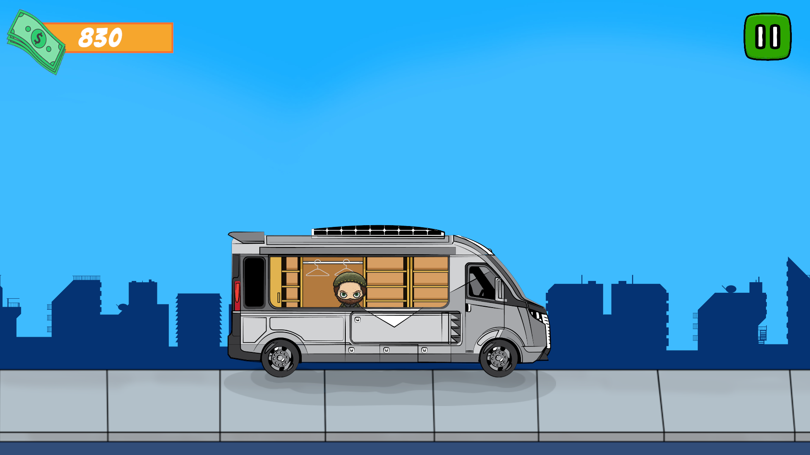
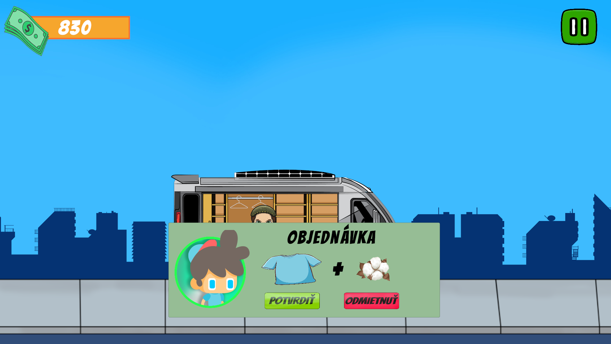
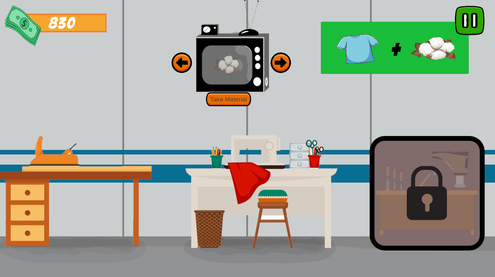
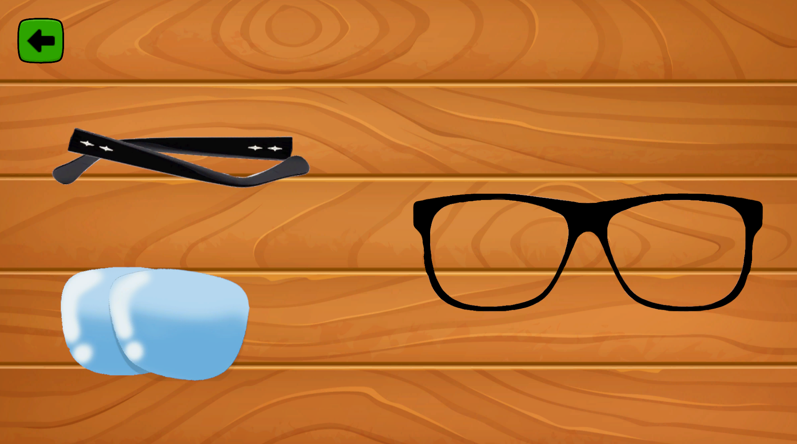
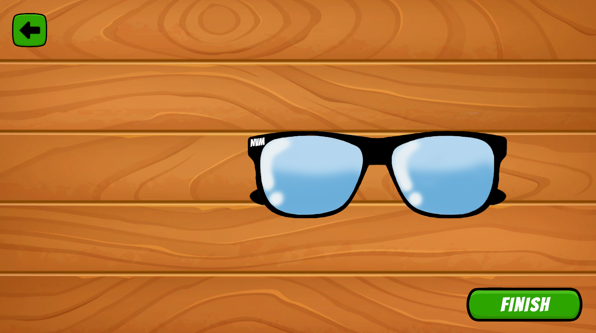
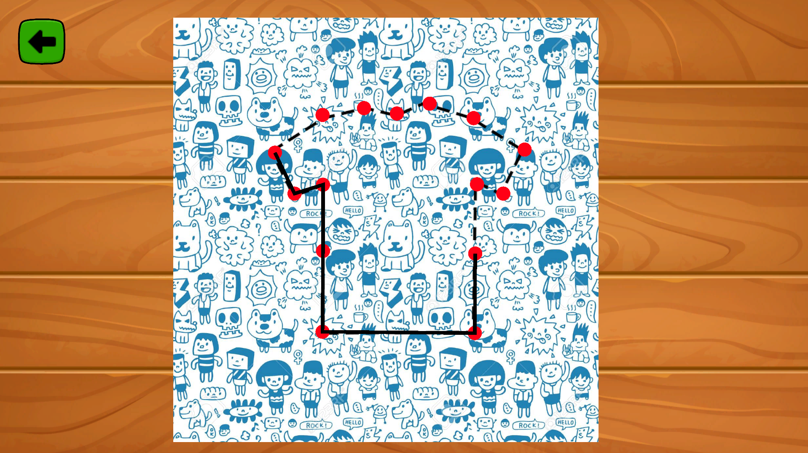

# ECOVAN GAME 🎮🌱
ECOVAN is a simple educational game developed as a school project to teach children about ecology and the idea that many everyday products can be made from recycled materials.

# About the Game
The game include 2 main tasks 
- Create galsses from recycled materials
- Create T-Shirts from recycled materials

    
    
    

# ✨ Game Features
- Money System (Earn money by completing tasks)
- Tasks for Cerate products (Glasses / T-Shirt)

    
    
    

📝 Planned goal: Grow your eco-business by unlocking new materials, upgrading your workshop, and expanding your product line.

⚠️ Note: Business upgrades and additional features are planned but not yet implemented.

<h1><a href="https://dominikk27.itch.io/ecovan-game-2">🕹️ Try the game on Itch.io </a></h1>
⚠️ Note: The game works best in fullscreen mode. Responsiveness for different screen sizes doesn't work properly.
